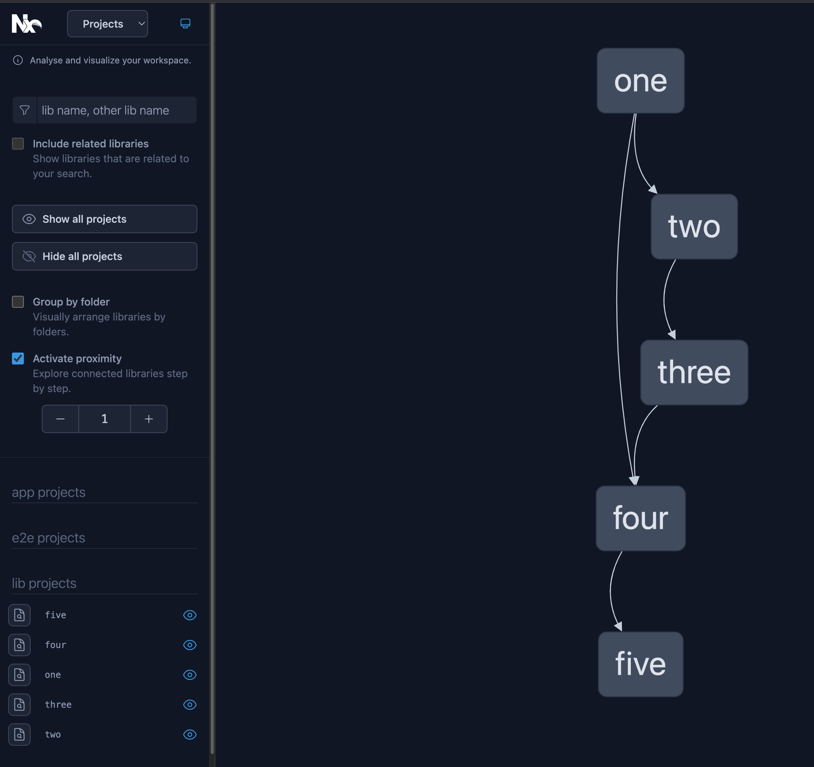

# Vite libs import demo

1. `yarn` to install deps
2. `npx nx run-many --target=build --parallel=false --skipNxCache`

All libs build successfully.

## Paths of libs

These are the paths of all the libs in this workspace, as defined in `tsconfig.base.json`:

```json
    "paths": {
      "@katerina/five": ["packages/five/src/index.ts"],
      "@katerina/four": ["packages/four/src/index.ts"],
      "@vnextjs/one": ["packages/one/src/index.ts"],
      "@vnextjs/three": ["packages/three/src/index.ts"],
      "@vnextjs/two": ["packages/two/src/index.ts"]
    }
```

## Dependency graph

This is the dependency graph:


